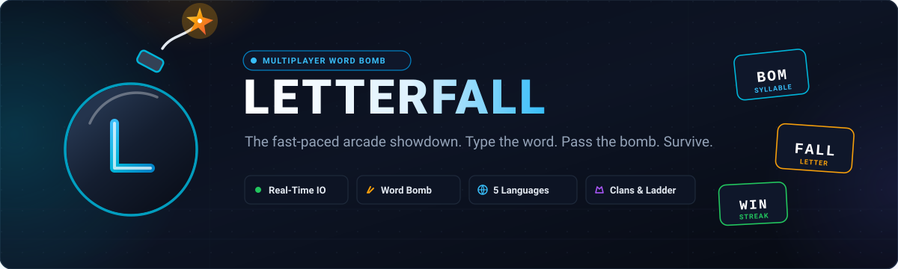
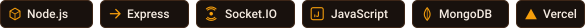
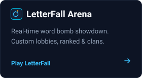
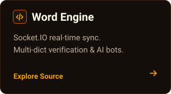
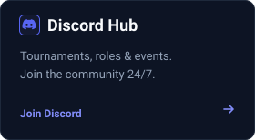

  

  <strong>LetterFall &mdash; The Ultimate Word Bomb Showdown</strong> 
  Real-time arcade multiplayer game where vocabulary, typing speed, and quick reflexes keep you alive.

  

  
  
  

  
  
  

 

---

### Highlights &amp; Architecture

| Feature | Description |
| :--- | :--- |
| 💣 **Word Bomb Mechanics** | Circular hot-potato bomb timer. Type an eligible word before the bomb explodes in your hands. |
| ⚡ **Sub-50ms Socket Sync** | Low-latency state synchronization with reconnection recovery and real-time player heartbeats. |
| 🌐 **Multilingual Verification** | Native dictionary and syllable generation across **French**, **English**, **Spanish**, **German**, and **Italian**. |
| 🏆 **Ranked Ladder &amp; Clans** | Climb competitive tiers, form player clans, earn seasonal XP, and unlock arcade badges. |
| 🤖 **Adaptive Bot Opponents** | Intelligent AI bots with natural typing jitter and dynamic vocabulary selection. |
| 🎨 **Arcade Customization** | Collectible bomb skins, interactive sound effects, custom explosion VFX, and dark retro aesthetic. |

 

### Organization Repositories

- **[`LetterFall/LetterFall`](https://github.com/LetterFall/LetterFall)** &mdash; The core multiplayer game codebase (Node.js 20, Express 5, Socket.IO 4, MongoDB, Vanilla JS).
- **[`LetterFall/.github`](https://github.com/LetterFall/.github)** &mdash; Organization profile, community health files, and global project assets.

 

### Creators &amp; Maintainers

  <a href="https://github.com/ellecrydansmesdm"><strong>Fahd (@ellecrydansmesdm)</strong></a> &bull;
  <a href="https://github.com/burberry639"><strong>Virtex (@burberry639)</strong></a>

 

  Got feedback or want to challenge players? Join our official community on <a href="https://discord.gg/xfb9TDZEba">Discord</a> or play right now at <a href="https://letterfall-game-ndkivl7c0-burberry639s-projects.vercel.app/">letterfall.app</a>.

